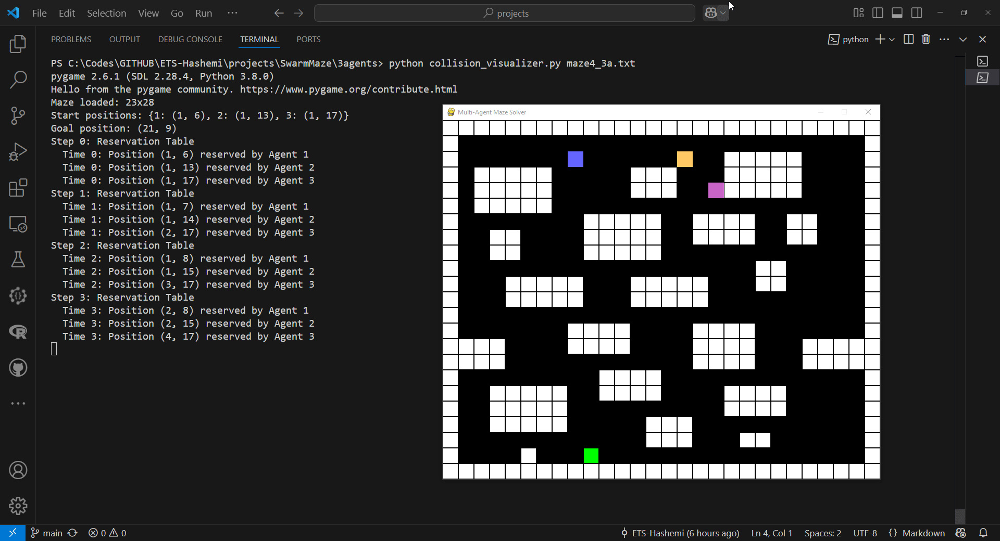

# 3Agents Maze Solver

The **3Agents Maze Solver** is a Python-based project designed to solve multi-agent pathfinding problems in a maze environment. It supports various search algorithms and visualizes the agents' exploration and pathfinding processes. The project is built with flexibility to handle multiple agents, collision avoidance, and customizable algorithms.

---

## Screenshot

<p align="center">
  
</p>

---

## Features

- Multi-agent pathfinding with **optimized collision avoidance**.
- Support for various search algorithms:
  - Breadth-First Search (BFS)
  - Depth-First Search (DFS)
  - A* Search
  - Greedy Best-First Search
- Visualization of exploration and path execution using `pygame`.
- Configurable maze structure with start and goal positions for agents.

---

## Algorithm Comparison

| Algorithm       | Optimality | Completeness | Time Complexity | Space Complexity |
|------------------|------------|--------------|------------------|------------------|
| **BFS**         | Yes        | Yes          | O(b^d)          | O(b^d)          |
| **DFS**         | No         | Yes          | O(b^m)          | O(b*m)          |
| **A***          | Yes        | Yes          | O(b^d)          | O(b^d)          |
| **Greedy**      | No         | No           | O(b^d)          | O(b^d)          |

- **Optimality**: Whether the algorithm guarantees the shortest path.
- **Completeness**: Whether the algorithm guarantees finding a solution if one exists.
- **Time Complexity**: `b` is the branching factor, and `d` is the depth of the shallowest solution.
- **Space Complexity**: Memory usage of the algorithm.

---

## Performance Metrics

The project calculates the following performance metrics for each agent:

1. **Path Length**:
   - The total number of steps taken by the agent to reach the goal.

2. **Explored Cells**:
   - The total number of cells explored by the agent during the search process.

### Example Output
```plaintext
==================================================
Performance Metrics for Algorithm: DFS
==================================================
Total Agents: 3
--------------------------------------------------
Agent     Path Length    Explored Cells
--------------------------------------------------
    1             101              250
    2              98              230
    3             105              270
==================================================
```

---

## Collision Avoidance Mechanism

The **3Agents Maze Solver** implements a robust and optimized **collision avoidance mechanism** to ensure that multiple agents can navigate the maze simultaneously without conflicts. This mechanism is seamlessly integrated into the pathfinding algorithms and visualized in `collision_visualizer.py`.

---

## Screenshot

<p align="center">
  
</p>

---

### 1. **Overview**
Collision avoidance is achieved using a **time-based reservation table**. This ensures that:
- No two agents occupy the same position at the same time.
- Agents can "wait in place" if no valid moves are available due to conflicts.
- Paths are dynamically planned to respect both spatial and temporal constraints.

### 2. **Reservation Table**
The reservation table is a dictionary that tracks the positions occupied by agents at specific time steps. It is the core of the collision avoidance mechanism.

- **Key**: A tuple `(position, time)` where `position` is a cell in the maze and `time` is the time step.
- **Value**: The ID of the agent occupying the position at that time.

For example:
```python
reservation = {
    ((2, 3), 0): 1,  # Agent 1 occupies position (2, 3) at time 0
    ((2, 4), 1): 2,  # Agent 2 occupies position (2, 4) at time 1
}
```

### 3. **Path Planning with Reservations**
When planning a path for an agent, the reservation table is checked to ensure that:
- The agent does not move into a position already reserved by another agent at the same time step.
- The agent does not collide with another agent waiting in place.

This is integrated into the pathfinding algorithms (e.g., BFS, A*, Greedy) by adding a reservation check before expanding a node.

### 4. **Updating the Reservation Table**
Once a path is found for an agent, its positions at each time step are added to the reservation table. This prevents subsequent agents from occupying the same positions at the same time.

For example:
```python
path = [(2, 3), (2, 4), (2, 5)]  # Path for Agent 1
for t, pos in enumerate(path):
    reservation[(pos, t)] = 1  # Reserve the position for Agent 1
```

### 5. **Waiting in Place**
If an agent cannot move due to a reservation conflict, it has the option to "wait in place" by staying in its current position for the next time step. This is treated as a valid move in the pathfinding algorithms.

### 6. **Algorithm Integration**
The collision avoidance mechanism is seamlessly integrated into the pathfinding algorithms. For example:
- **BFS**: Before adding a neighbor to the queue, the reservation table is checked.
- **A***: The reservation table is considered when calculating the cost of a move.
- **Greedy**: The heuristic function respects the reservation constraints.

### 7. **Visualization in `collision_visualizer.py`**
The `collision_visualizer.py` file provides a detailed visualization of the collision avoidance mechanism:
- **Reserved Cells**: Highlighted in red to indicate positions reserved by agents at specific time steps.
- **Collisions**: Highlighted in yellow if two agents attempt to occupy the same position at the same time.
- **Agents' Paths**: Color-coded to distinguish between agents.
- **Waiting in Place**: Agents waiting due to conflicts are shown stationary for the conflicting time step.

---

## Troubleshooting

### Common Issues

1. **`pygame` Installation Issues**:
   - Ensure you have Python 3.7 or higher installed.
   - Install `pygame` using:
     ```bash
     pip install pygame
     ```

2. **Maze File Formatting**:
   - Ensure the maze file follows the correct format:
     - Use `A1`, `A2`, `A3` for agent start positions.
     - Use `B` for the goal position.
     - Use `#` for walls and spaces for open paths.

3. **Visualization Not Displaying**:
   - Ensure your system supports `pygame` and has a graphical display.
   - Run the script in a terminal or IDE that supports graphical output.

---

## File Structure

### Code Structure Overview

| File                     | Description                                                                 |
|--------------------------|-----------------------------------------------------------------------------|
| `main_3a.py`             | Main entry point for solving the maze and visualizing the solution.         |
| `collision_visualizer.py`| Visualizes the collision avoidance mechanism step by step.                  |
| `maze.py`                | Core logic for parsing the maze and integrating pathfinding algorithms.     |
| `algorithms.py`          | Implements various search algorithms (BFS, DFS, A*, Greedy).               |
| `reservation.py`         | Manages the reservation table for collision avoidance.                     |
| `config.py`              | Centralized configuration for colors, cell size, and algorithm defaults.   |
| `maze4_3a.txt`           | Example maze file defining the maze structure.                             |

---

## Future Work

- **Dynamic Agent Prioritization**:
  - Implement dynamic prioritization of agents based on their distance to the goal or other heuristics.

- **Support for Larger Mazes**:
  - Optimize the algorithms to handle larger and more complex mazes efficiently.

- **Integration with Real-World Robotics**:
  - Extend the project to simulate real-world multi-robot pathfinding scenarios.

- **Additional Algorithms**:
  - Add support for advanced algorithms like Dijkstra's, Bidirectional Search, and Iterative Deepening DFS.

- **Improved Visualization**:
  - Add more detailed visualizations, such as heatmaps for explored cells or agent-specific animations.

---

## How to Use

### Prerequisites
- Python 3.7 or higher.
- `pygame` library: Install using:
  ```bash
  pip install pygame
  ```

### Running the Project

#### 1. **Using `main_3a.py`**
The `main_3a.py` script calculates paths for all agents, handles collision avoidance, and visualizes the exploration and path execution.

Run the script with the maze file and an optional algorithm:
```bash
python main_3a.py maze4_3a.txt [algorithm]
```

- **Default Algorithm**: If no algorithm is specified, it defaults to `bfs` (Breadth-First Search).
- **Supported Algorithms**: `bfs`, `dfs`, `astar`, `greedy`.

#### Example:
To solve the maze using A*:
```bash
python main_3a.py maze4_3a.txt astar
```

#### Output:
- The console will display the path length and explored cells for each agent.
- A `pygame` window will visualize the exploration and path execution.

---

#### 2. **Using `collision_visualizer.py`**
The `collision_visualizer.py` script provides a step-by-step visualization of the collision avoidance mechanism.

Run the script with the maze file and an optional algorithm:
```bash
python collision_visualizer.py maze4_3a.txt [algorithm]
```

- **Default Algorithm**: If no algorithm is specified, it defaults to `bfs` (Breadth-First Search).
- **Supported Algorithms**: `bfs`, `dfs`, `astar`, `greedy`.

#### Example:
To visualize the collision avoidance mechanism using Greedy Best-First Search:
```bash
python collision_visualizer.py maze4_3a.txt greedy
```

---

## Customizing the Maze
- Edit `maze4_3a.txt` to define your own maze.
- Use `A1`, `A2`, `A3` for agent start positions and `B` for the goal.
- Use `#` for walls and spaces for open paths.

---

## License

```
Copyright 2023 Your Name

Licensed under the Apache License, Version 2.0 (the "License");
you may not use this file except in compliance with the License.
You may obtain a copy of the License at

    http://www.apache.org/licenses/LICENSE-2.0

Unless required by applicable law or agreed to in writing, software
distributed under the License is distributed on an "AS IS" BASIS,
WITHOUT WARRANTIES OR CONDITIONS OF ANY KIND, either express or implied.
See the License for the specific language governing permissions and
limitations under the License.
```

---

## Contributing
Contributions are welcome! Feel free to submit issues or pull requests to improve the project.

---

## Acknowledgments
- Inspired by multi-agent pathfinding problems in robotics and AI.
- Built using Python and `pygame` for visualization.

---

## Academic Attribution
This project is developed as part of the PhD research of  
**Seyed Masoud Hashemi Ahmadi**  
at **École de technologie supérieure (ÉTS), Montréal**.

If you use this work in academic research, citation is appreciated.
