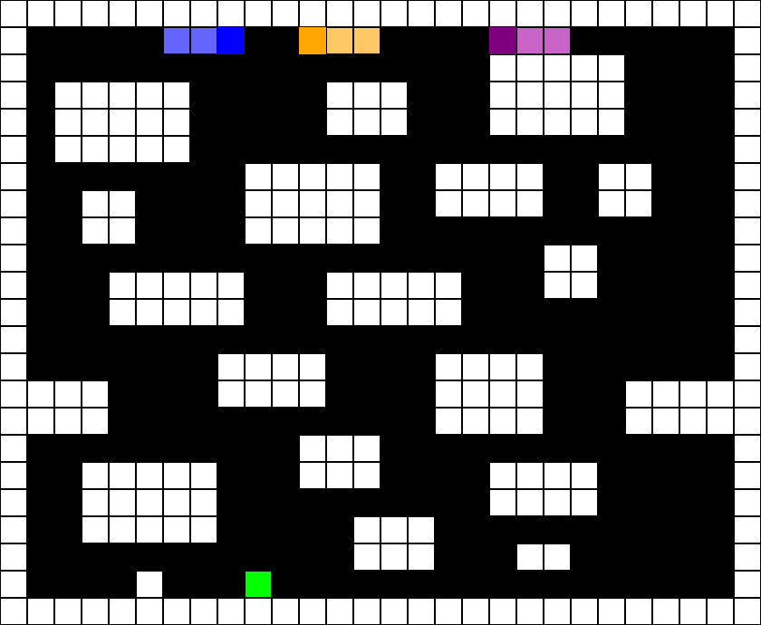

# 3Agents Maze Solver

The **3Agents Maze Solver** is a Python-based project designed to solve multi-agent pathfinding problems in a maze environment. It supports various search algorithms and visualizes the agents' exploration and pathfinding processes. The project is built with flexibility to handle multiple agents, collision avoidance, and customizable algorithms.


---

## Screenshot

<p align="center">
  
</p>


---

## Features

- Multi-agent pathfinding with collision avoidance.
- Support for various search algorithms:
  - Breadth-First Search (BFS)
  - Depth-First Search (DFS)
  - A* Search
  - Greedy Best-First Search
- Visualization of exploration and path execution using `pygame`.
- Configurable maze structure with start and goal positions for agents.

---

## Collision Avoidance Mechanism

The **3Agents Maze Solver** implements a robust **collision avoidance mechanism** to ensure that multiple agents can navigate the maze simultaneously without conflicts. This is achieved using a **time-based reservation table**. Below is a detailed explanation of how this mechanism works:

### 1. **Reservation Table**
The reservation table is a dictionary that tracks the positions occupied by agents at specific time steps. It ensures that no two agents occupy the same position at the same time.

- **Key**: A tuple `(position, time)` where `position` is a cell in the maze and `time` is the time step.
- **Value**: The ID of the agent occupying the position at that time.

For example:
```python
reservation = {
    ((2, 3), 0): 1,  # Agent 1 occupies position (2, 3) at time 0
    ((2, 4), 1): 2,  # Agent 2 occupies position (2, 4) at time 1
}
```

### 2. **Path Planning with Reservations**
When planning a path for an agent, the reservation table is checked to ensure that:
- The agent does not move into a position already reserved by another agent at the same time step.
- The agent does not collide with another agent waiting in place.

This is integrated into the pathfinding algorithms (e.g., BFS, A*, Greedy) by adding a reservation check before expanding a node.

### 3. **Updating the Reservation Table**
Once a path is found for an agent, its positions at each time step are added to the reservation table. This prevents subsequent agents from occupying the same positions at the same time.

For example:
```python
path = [(2, 3), (2, 4), (2, 5)]  # Path for Agent 1
for t, pos in enumerate(path):
    reservation[(pos, t)] = 1  # Reserve the position for Agent 1
```

### 4. **Waiting in Place**
If an agent cannot move due to a reservation conflict, it has the option to "wait in place" by staying in its current position for the next time step. This is treated as a valid move in the pathfinding algorithms.

### 5. **Algorithm Integration**
The collision avoidance mechanism is seamlessly integrated into the pathfinding algorithms. For example:
- **BFS**: Before adding a neighbor to the queue, the reservation table is checked.
- **A***: The reservation table is considered when calculating the cost of a move.
- **Greedy**: The heuristic function respects the reservation constraints.

### 6. **Example**
Consider a scenario with two agents:
- Agent 1 starts at `(1, 1)` and moves to `(1, 2)` at time 1.
- Agent 2 starts at `(1, 2)` and plans to move to `(1, 1)` at time 1.

Without collision avoidance, both agents would collide at `(1, 2)` at time 1. With the reservation table:
- Agent 1 reserves `(1, 2)` at time 1.
- Agent 2 detects the conflict and waits in place at `(1, 2)` for time 1.

### 7. **Visualization**
The collision avoidance mechanism is visualized in the `pygame` window:
- Agents' paths are color-coded.
- Shared paths (if any) are highlighted in gray.
- Agents waiting in place are shown stationary for the conflicting time step.

---

## File Structure

### `algorithms.py`
Contains the implementation of various search algorithms, including:
- **DFS**: Depth-First Search
- **BFS**: Breadth-First Search
- **AStar**: A* Search
- **Dijkstra**: Dijkstra's Algorithm
- **GreedyBestFirst**: Greedy Best-First Search
- **RandomWalk**: Randomized exploration
- **BidirectionalSearch**: Bidirectional Search
- **IterativeDeepeningDFS**: Iterative Deepening Depth-First Search
- **HillClimbing**: Hill Climbing Search
- **MultiAgentSearch**: Framework for multi-agent pathfinding.

### `visualizer.py`
Handles the visualization of the maze and agents' movements. Key features:
- Draws the maze structure, agents, and their paths.
- Animates the exploration process and path execution.
- Supports smooth animations for agent movements.

### `solver.py`
Currently empty but reserved for additional solver logic or utilities.

### `maze4_3a.txt`
Defines the maze structure in a text-based format. Key elements:
- `A1`, `A2`, `A3`: Start positions for agents 1, 2, and 3.
- `B`: Goal position.
- `#`: Walls.
- ` `: Open spaces.

### `maze.py`
Core logic for parsing and representing the maze. Includes:
- Maze parsing from a text file.
- Neighbor calculation for traversable cells.
- Pathfinding utilities for BFS, DFS, A*, and Greedy algorithms.
- Visualization integration with `pygame`.

### `main_3a.py`
The main entry point for the project. Responsibilities:
- Loads the maze file and initializes the maze, pathfinder, and visualizer.
- Executes the selected search algorithm for each agent.
- Handles collision avoidance using a reservation table.
- Visualizes the exploration and path execution.

## How to Use

### Prerequisites
- Python 3.7 or higher.
- `pygame` library: Install using `pip install pygame`.

### Running the Project
1. Clone the repository:
   ```bash
   git clone https://github.com/your-username/3agents-maze-solver.git
   cd 3agents-maze-solver
   ```
2. Run the main script with the maze file and optional algorithm:
   ```bash
   python main_3a.py maze4_3a.txt [algorithm]
   ```
   - Replace `[algorithm]` with one of the supported algorithms (`bfs`, `dfs`, `astar`, `greedy`). Defaults to `bfs`.

### Example
To solve the maze using A*:
```bash
python main_3a.py maze4_3a.txt astar
```

### Output
- The console will display the path length and explored cells for each agent.
- A `pygame` window will visualize the exploration and path execution.

## Customizing the Maze
- Edit `maze4_3a.txt` to define your own maze.
- Use `A1`, `A2`, `A3` for agent start positions and `B` for the goal.
- Use `#` for walls and spaces for open paths.

## License

```
Copyright 2023 Your Name

Licensed under the Apache License, Version 2.0 (the "License");
you may not use this file except in compliance with the License.
You may obtain a copy of the License at

    http://www.apache.org/licenses/LICENSE-2.0

Unless required by applicable law or agreed to in writing, software
distributed under the License is distributed on an "AS IS" BASIS,
WITHOUT WARRANTIES OR CONDITIONS OF ANY KIND, either express or implied.
See the License for the specific language governing permissions and
limitations under the License.
```

## Contributing
Contributions are welcome! Feel free to submit issues or pull requests to improve the project.

## Acknowledgments
- Inspired by multi-agent pathfinding problems in robotics and AI.
- Built using Python and `pygame` for visualization.

##  Academic Attribution
This project is developed as part of the PhD research of  
**Seyed Masoud Hashemi Ahmadi**  
at **École de technologie supérieure (ÉTS), Montréal**.

If you use this work in academic research, citation is appreciated.
