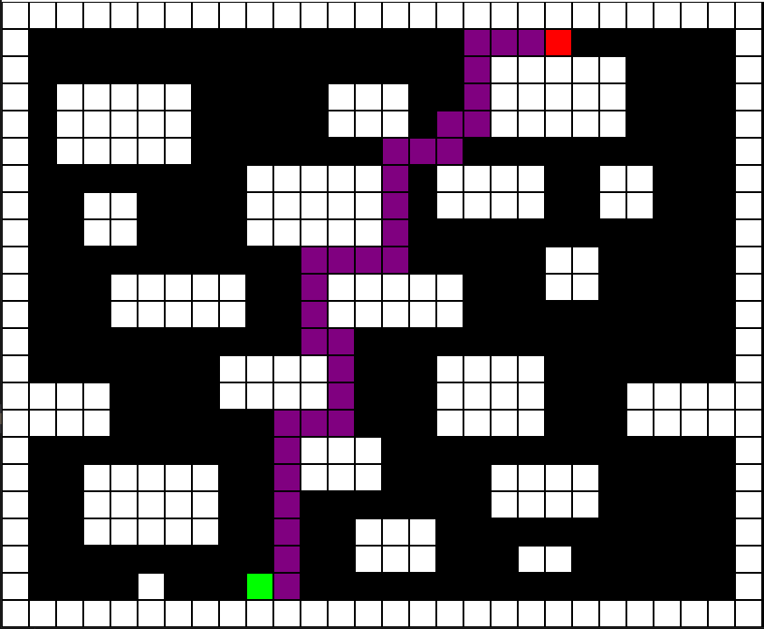

#  Swarmaze — Trajectory Module

This module is the **core engine** of the Swarmaze project. It implements and visualizes classical pathfinding algorithms on a 2D maze using **Pygame**. Algorithms like A*, BFS, DFS, and more are brought to life with animated step-by-step exploration, making this ideal for learning, teaching, or research in search strategies and trajectory planning.

---

##  Screenshot


<p align="center">
  
</p>


---

##  Contents

### `main.py`
- Command-line entry point.
- Usage:  
  ```bash
  python main.py maze.txt [algorithm]
  ```
  Where `algorithm` is one of:
  ```
  dfs | bfs | astar | dijkstra | greedy | randomwalk | bidirectional | iddfs | hillclimbing
  ```
- Loads a maze from a text file and runs the selected algorithm with real-time visual feedback.

### `maze.py`
- Maze parsing, environment modeling, and neighbor discovery.
- Includes:
  - `Maze`: grid layout, wall detection, start/goal detection
  - `Node`: tree node used for storing state, parent, cost, heuristic
  - `StackFrontier`, `QueueFrontier`: for DFS/BFS

### `algorithms.py`
- Contains all implemented search algorithms as classes with `.solve()` methods.
- Algorithms:
  -  **DFS** — Depth-First Search  
  -  **BFS** — Breadth-First Search  
  -  **A\*** — with Manhattan distance heuristic  
  -  **Dijkstra** — cost-based, uniform search  
  -  **Greedy Best-First** — fast but not always optimal  
  -  **Random Walk** — stochastic exploration  
  -  **Bidirectional Search** — expands from both ends  
  -  **Iterative Deepening DFS** — DFS with increasing depth limit  
  -  **Hill Climbing** — greedy ascent (risk of local minima)

### `visualizer.py`
- Uses Pygame to visualize:
  - Walls, open paths, start/goal nodes
  - Explored cells (yellow)
  - Active agent (blue)
  - Final solution path (purple)
- Provides `.draw_maze()` and `.wait_for_exit()` methods

---

##  How to Run

Install dependencies:

```bash
pip install pygame
```

Run the visualizer (inside `trajectory/` folder):

```bash
python main.py maze.txt astar
```

---

## Maze File Format

Maze must be a text file like:

```
##########
#A     #B#
# ### ####
#        #
##########
```

- `A` → Start  
- `B` → Goal  
- ` ` → Walkable space  
- `#` or any other → Wall

---

## Notes

- All algorithms animate their step-by-step progress.
- You can adjust animation delay by setting `Visualizer(maze, delay=200)` in milliseconds.
- Error messages are shown if the maze has no solution.

---

## Extension Ideas

- Add diagonal movement, dynamic weights, or teleportation portals
- Visualize performance metrics: time, steps, nodes expanded
- Add GUI input for maze design or real-time re-planning
- Connect with Swarmaze 3D engine for multi-agent extensions

---

##  Academic Attribution
This project is developed as part of the PhD research of  
**Seyed Masoud Hashemi Ahmadi**  
at **École de technologie supérieure (ÉTS), Montréal**.

If you use this work in academic research, citation is appreciated.
